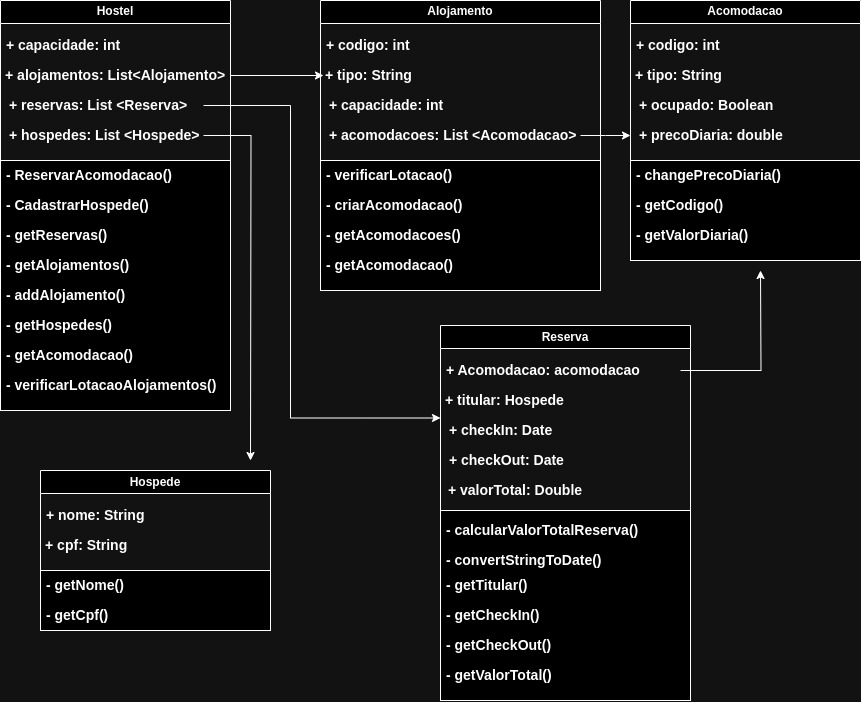

<link rel="stylesheet" type="text/css" href="style.css">

# Engenharia de Software com Bertoti

## Atividade 01: O que é engenharia de software para o Google?

  
  <figcaption>Dentro do Google, dizem: "Engenharia de software é programação integrada ao tempo." </figcaption>

 
A programação é certamente uma parte significativa da engenharia de software: afinal, é por meio da programação que você gera novo software. Se aceitarmos essa distinção, também fica claro que talvez precisemos delinear entre tarefas de programação (desenvolvimento) e tarefas de engenharia de software (desenvolvimento, modificação, manutenção). O tempo adiciona uma nova dimensão importante à programação. Cubos não são quadrados, distância não é velocidade. Engenharia de software não é programação.

03 são as diferenças críticas entre programação e engenharia de software: tempo, escala e os compromissos em jogo. Em um projeto de engenharia de software, os engenheiros precisam se preocupar mais com a passagem do tempo e a eventual necessidade de mudança. Em uma organização de engenharia de software, precisamos nos preocupar mais com a escala e eficiência, tanto para o software que produzimos quanto para a organização que o produz. Finalmente, como engenheiros de software, somos solicitados a tomar decisões mais complexas com resultados de alto risco, frequentemente baseados em estimativas imprecisas de tempo e crescimento.

Então, o que é engenharia de software na sua visão?

Threadoff, escabilidade e no tempo. 

Com base nessas distinções, podemos definir a engenharia de software como:

* Uma disciplina mais ampla do que a programação, abrangendo todo o ciclo de vida do software, desde o desenvolvimento inicial até a manutenção de longo prazo.
* Uma aplicação de princípios de engenharia à criação de software, considerando fatores como eficiência, escalabilidade, manutenibilidade e adaptabilidade ao longo do tempo.
* Prática que envolve tomada de decisões complexas com compensações significativas e consequências de longo prazo.

Ou seja, 

A engenharia de software vai além da escrita de código para abranger todo o processo de construção e sustentação de sistemas de software eficientes, de alta qualidade e em evolução, que atendam às necessidades das partes interessadas ao longo do tempo.

Todo software sofre depreciações ao longo do tempo, e a engenharia serve para reduzir o atrito do tempo na utilidade do software. A escala é extremamente importante na engenharia de software, pois um produto pode se tornar completamente inviável se crescer sob pilares limitadores. Compromissos sempre existirão, e é na engenharia de software que é feita a análise de quais são suportáveis para o produto que o software pretende entregar e os problemas que ele visa resolver.

## Atividade 02: mencione três threadoff.

Threadoff do dia-a-dia

1º Durmo mais tempo, me atraso para o trabalho.
2º Tenho razão ou fico em paz, em uma briga.
3º Recomeço uma carreira que tenha de trabalhar HomeOffice ganhando menos hoje, ou continuo na mesma carreira qual já sou consolidada e qualificada, mas com o trabalhando presencial predominantemente.

THreadoff da vida de programação

1º Banco de dados mal pensado para uma arquitetura que vai requer escalabilidade. Ou seja, ganha-se tempo com o lançamento do MVP, mas pode travar o desenvolvimento futuro. 
2º Linguaguem de programação com curva de aprendizado complexa, porém, rápida, mas que não se encontra mão de obra no mercado.
3º* Uso de serviços externos como AWS para escalabilidade, porém, custo em dolar AWS para cada operação. 

## Atividade 03: Comente os threadoff das arquiteturas apresentados

**Layered Architecture Style**

É uma arquitetura pensada em camadas, regras de apresentação primeiro (frontend), regras de negócio, persistência, e por fim, banco. Isso promove isolamento das camadas, e caso seja necessário mudar o tipo de banco, isso causa grande impacto na camada do banco, mas pouco nas demais. 

1. Ela é péssima de deploy. 
2. Sobre receber novas funcionalidades é interessante. 
3. Em relação de tolerancia a falha, ele é muito fraco, algo estoura, o erro alastra. 
4. Modulariedade é péssima, algo que denuncia um extremo acoplamento. 
5. O custo dele é bem barato.
6. Sua performace é ruim.
7. Para retornar sozinha, é melhor, consegue. 
8. Escalabilidade é péssima, então não aguenta carga.
9. É simples demais, e possivelmente ser testado de forma geral. Os testes são mais fáceis porque os componentes pertencem a camadas específicas, e dá para testar separadamente. 

Aplicações GIS que lidam com a visualização de mapas, análise de dados geoespaciais e consultas frequentemente empregam uma arquitetura em camadas para organizar essas funcionalidades distintas. Em sistemas de informação geográfica, como mapas digitais, a estrutura em camadas é frequentemente utilizada. Cada camada representa diferentes conjuntos de dados, como estradas, fronteiras, relevos, etc. Essas camadas podem interagir para fornecer uma visão completa e rica da informação geográfica.

[Padroes de Arquitetura](https://priyalwalpita.medium.com/software-architecture-patterns-layered-architecture-a3b89b71a057)

**Pipeline Architecture Style**

Utiliza filtros e encaminhamento como tubos. Os tubos são geralmente unidirecionais e ponto a ponto, o que significa que não transmitem de um filtro para vários filtros. 

1. Ela é ruim de deploy. 
2. Sobre receber novas funcionalidades é bom. 
3. Em relação de tolerancia a falha, ele é mediocre, algo estoura, tudo alastra. A tolerância a falhas é baixa porque o design monolítico leva a um único ponto de falha. A falha de qualquer filtro pode levar à falha de todo o pipeline.
4. Modulariedade, ele é interessante, apesar de ter fraca tolerancia a falha. 
5. O custo dele é bem barato.
6. Sua performace é ruim.
7. Para retornar sozinha, é melhor, consegue. 
8. Escalabilidade é péssima, então não aguenta carga.
9. É simples demais, e possivelmente ser testado de forma geral. Por ser um estilo de arquitetura monolítica, as implantações e os testes são difíceis. Mesmo mudanças simples exigem que todo o sistema seja totalmente testado e reimplantado.
10. E é possível ser bem testado. 

Em sistemas de processamento de imagens e vídeos, a arquitetura de Pipeline é aplicada para realizar tarefas como compressão, filtragem e análise, dividindo o processo em estágios consecutivos. Outra questão seria as pipelines voltadas as ETLs. Ou fluxo de pipelines, onde existe etapas, algo só passa para próxima, quando 

**Microkernel Architecture Style**

1. Ela é muito bom de deploy. 
2. Sobre receber novas funcionalidades é bom. 
3. Em relação de tolerancia a falha, ele é ótimo. 
4. Modulariedade é excelente
5. O custo dele é bem barato.
6. Sua performace é bem bom.
7. Para retornar sozinha, é melhor, se ergue bem. 
8. Escalabilidade é boa, aguenta carga.
9. Um pouco menos simples, mas ainda dá para aprender bastante.
10. E muito bem estável. 

Sistemas embarcados, a abordagem microkernel é vantajosa ao isolar funcionalidades críticas, garantindo maior segurança, confiabilidade e a capacidade de atualizar componentes específicos sem comprometer a estabilidade do sistema como um todo. Algo sobre o SO.

**Event-Driven Architecture Style**

1. Ela é bom de deploy. 
2. Sobre receber novas funcionalidades de forme excelente. 
3. Em relação de tolerancia a falha, é excelente. 
4. Modulariedade é muito bom.
5. Ele é muito caro.
6. Sua performace não é boa.
7. Para retornar sozinha, é melhor, se ergue bem. 
8. Escalabilidade é perfeito, aguenta carga.
9. Não é nada simples
10. Ele é super estável.

Sistema de Notificações em uma Plataforma de Comércio Eletrônico. Ela ajuda a lidar com diferentes eventos, como confirmações de pedidos, de maneira eficiente e independente. Tem a capacidade de unir sistemas diferentes por meio de um orquestrador, por exemplo, kafka. 

**Atividade 04: Análise da Arquitetura, e qual você aplicaria?**

Arquitetura de camadas para um sistema de reserva de hostel. 
Sabendo que os hostel dispõe de diferentes orçamento, é importante ter peças móveis que atendam seus usuários. 
Ruim é a parte do deploy, que é mais complexo, e qualquer hostel precisa está com seu site na internet para se internacionalizar. Mas o custo dele é barato.
No geral, é bem simples, e isso importa muito para as pessoas que vão manejar não tem foco no desenvolvimento de um software de alto desempenho, e sim, o turísmo. 

**Atividade 05: classes uml**

Classes de uma pipeline

**Atividade 06: Escrever o código em Java**

Escrevemos o código em Java tanto do UML acima 
Nos arquivos Hostel.java, Acomodacao.java, Alojamento.java, Hospede.java e Reserva.java.

**Atividade 07: Testes dos códigos**

Testes de assert com TesteHostel.java

